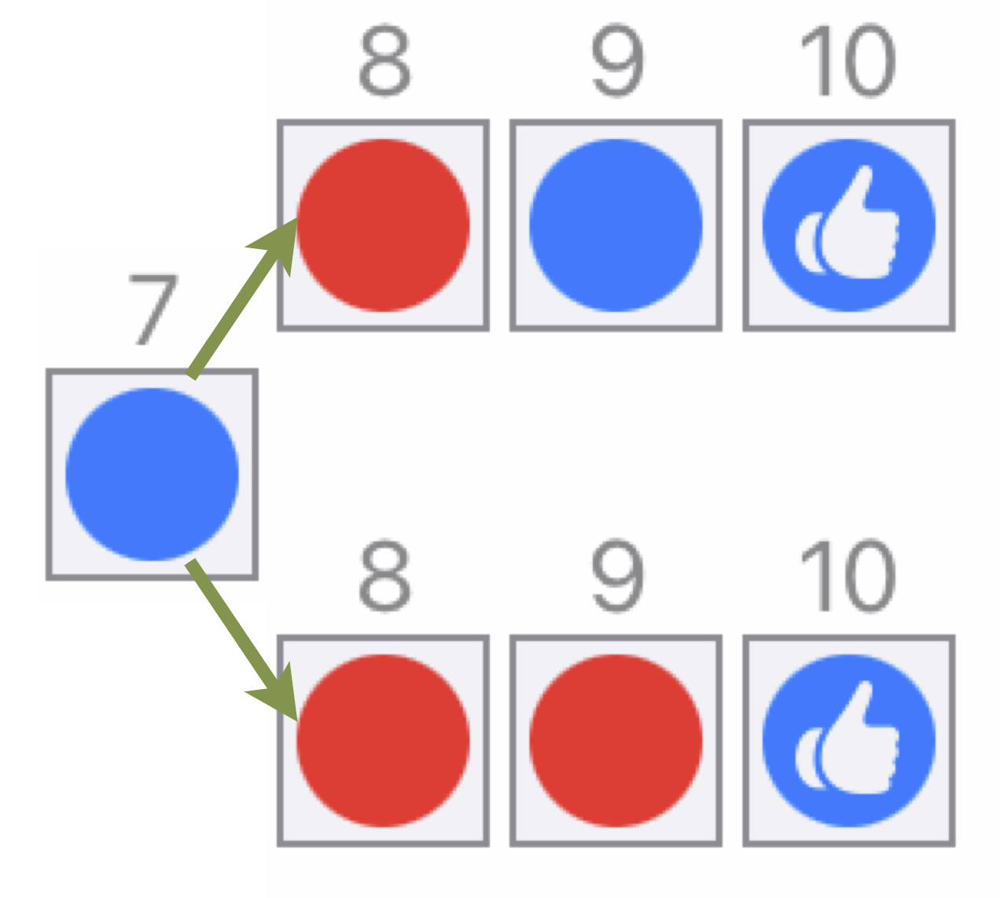
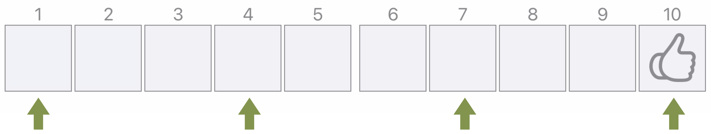
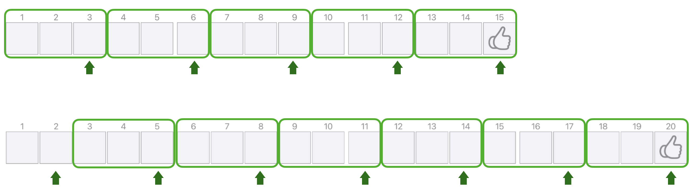
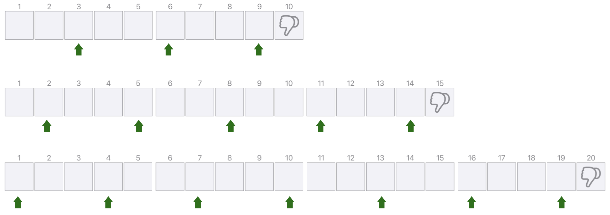

# Das Nim-Spiel


## Spielregeln

### Klassische Spielregeln

Zwei Personen spielen gegeneinander. 
Abwechselnd legen sie (beginnend links bei Feld 1) Plättchen ihrer Farbe sukzessive auf den Spielplan. 
Man darf wahlweise jeweils ein oder zwei Plättchen auf die freien Plätze legen. Gewonnen hat, wer das letzte Feld belegt.

```{r Spielfeld, echo=FALSE, fig.cap="Spielplan mit 10 Feldern ", fig.align='center', out.width='75%'}
knitr::include_graphics("pictures/Spielplan.png")
```

### Hinweise

*	Das Nim-Spiel wird also immer von zwei^[Weitere Personen, die eine Weile die Spielverläufe *beobachtend* verfolgen, können sich aber gedanklich ebenso an der Suche nach der Gewinnstrategie beteiligen.] Personen gespielt.
* Die Spielregeln sind einfach und auch für **jüngere Kinder** unmittelbar zu verstehen.
* Der Pfiff: Dem Spiel liegt eine **Gewinnstrategie** zugrunde, d. h. dass man jedes Spiel zu *jedem* Zeitpunkt (!) des Spielverlaufs kontrollieren und damit auch *determinieren* kann, dass man sicher gewinnt -- sofern man die Strategie kennt und ihr konsequent folgt.
* Ziel des Spiels ist es (zunächst), diese sichere Gewinnstrategie^[Wenn eine der spielenden Personen die Strategie kennt und beherrscht, verliert das Spiel natürlich – zunächst jedenfalls! – seinen Reiz. Neue Herausforderungen -- auch für ältere Schülerinnen und Schüler und Erwachsene -- stellen sich aber ad hoc ein, wenn man sich auf die verschiedenen Variationen einlässt (vgl. Abschnitte \@ref(variation-der-feldlaenge) bis \@ref(allgemeine-gewinnstrategie))!] zu erkunden, sowie erklären und begründen zu können.

Im Abschnitt \@ref(gewinnstrategie) wird die Gewinnstrategie für den o. g. konkreten Fall und für diverse Regelvariationen bis hin zum allgemeinen Fall entwickelt und dargestellt. 
Es ist aber sehr zu empfehlen, sich zuvor **ausdauernde Selbsterfahrungen** mit diversen konkreten Spieldurchgängen zu gönnen. 

Versuchen Sie also zunächst, die Gewinnstrategie möglichst selbst herauszufinden -- zumindest für den Fall der Feldlänge 10 und der Legeanzahl zwei Plättchen, denn: 

* Selberfinden ist immer ergiebiger und bietet ein größeres **Spielvergnügen** als Vorgegebenes nur nachzuvollziehen (und dann manchmal nur irrtümlich zu glauben, man hätte das Prinzip verstanden).
* Ein eigener Erfahrungshintergrund – durchaus mit Aufs und Abs – ist sehr wertvoll, um als Beobachterin oder Beobachter die Spielverläufe anderer, z. B. Ihrer Schülerinnen und Schüler, einschätzen und ggf. sachgerechte **Hilfen oder Impulse** anbieten zu können.

Beobachten Sie sich selbst^[Diese Beobachtung kann auch eine dritte, nicht mitspielende Person übernehmen/protokollieren.] gezielt daraufhin, wie Sie sich in einzelnen Phasen verhalten: 

* Wie gehen Sie selbst vor? Wie reagieren Sie auf die Lege-Aktionen der Spielpartnerin/des Spielpartners?
* Welche Vermutungen haben Sie im Hinblick auf eine Gewinnstrategie?
* Wie prüfen Sie deren Gültigkeit?
* Wann geht Ihre Geduld oder Ausdauer zu Ende? Woran liegt das Ihrer Meinung nach? Wie viele Spieldurchgänge haben Sie realisiert?
*	Wie könnten Sie einen anderen Ansatz finden?

**Alle diese Fragen sind nicht nur in diesem Rahmen Ihrer Selbsterfahrungen relevant und hilfreich, sondern in gleicher Weise für die Organisation der Lernprozesse rund um das Nim-Spiel im Unterricht.**


##	Typische Phasen im Spielverlauf

### Freies Spielen

Zunächst werden – unbeschwert und noch wenig strategisch – **mehrere Spieldurchgänge** unternommen. 
Diese Phase ist nicht gering zu schätzen! Einerseits liefert sie den beschriebenen **Erfahrungshintergrund** für die folgende bewusstere Auseinandersetzung, und andererseits dient sie (v. a. bei jüngeren Kindern) der **Festigung der Spielregeln**. 
Insbesondere Kinder neigen in dieser Phase auch dazu, akribisch den Spielstand im Blick zu behalten (»Bei uns steht es 6:4!«), obwohl es um den eigentlich am wenigstens geht.

### Erste Vermutungen

Bald werden auch **Ideen** darüber geäußert, **was wohl für das Gewinnen oder Verlieren verantwortlich sein könnte**. 
Diese sind anfangs noch wenig argumentativ durchdrungen oder abgesichert; sie beruhen eher auf spontanen Assoziationen, evoziert durch situativ Erlebtes wie einen gerade gewonnenen Spieldurchgang. Amüsanter – für Erwachsene, denn für Kinder kann auch das eine ernst gemeinte, wenn auch »magische« Vermutung sein – wirkt die Bitte: »Jetzt möchte ich aber mal die blauen Plättchen haben!«

### Gezieltere Analyse

Nach einer gewissen Zahl von Spieldurchgängen – und diese kann, je nach Ausdauer, eine beträchtliche Variation aufweisen! – wird dann eine Position (**Gewinnposition**) auf dem Spielplan augenfällig (erkennbar am Stutzen oder großen Augen), ab der man mit Gewissheit sagen kann, ob man verlieren oder gewinnen wird. 
Auf dem Spielplan bis 10 ist das die Position 7. 
Denn wie die Abb. \@ref(fig:Gewinnposition7) zeigt, gibt es ab dann nur noch zwei Optionen für den bereits feststehenden Sieger: 
Entweder sein Spielpartner legt ein rotes Plättchen, dann gewinnt Blau mit zwei gelegten Plättchen. 
Oder der Spielpartner legt zwei rote Plättchen, dann belegt Blau mit einem Plättchen die 10 und gewinnt. 
Die Abbildung ist auch eine praktikable Darstellungsweise für eine Begründung im Unterricht.
 
```{r Gewinnposition7, echo=FALSE, fig.cap="Gewinnposition 7", fig.align='center', out.width='25%'}

```

Auffällig ist an dieser Stelle – übrigens sowohl bei Erwachsenen als auch bei Grundschulkindern –, dass mancher sich hier bereits am Ziel wähnt, wenn die 7 als Gewinnposition identifiziert wurde. 
Man bedenke aber die Spielregeln, insbesondere Punkt 3 der eingangs genannten Hinweise: 
Nicht erst hier bei der 7 soll man wissen, dass/ob man gewinnen wird, sondern zu *jedem Zeitpunkt* des Spielverlaufs! 
Das meint im Prinzip: **Gleich zu Spielbeginn** und nicht erst vor der letzten Gewinnposition **kann man sein Gewinnen abschätzen**. 
Ansonsten würde dies ja (erst recht bei längeren Spielplänen) auch die Frage aufwerfen, ab wann man denn seine Aufmerksamkeit darauf fokussieren sollte, dass die erkannte Gewinnposition näher rückt und wie man sich dann verhalten sollte.


## Gewinnstrategie

### Ausgangsparameter

> Feldlänge 10 -- Legezahl 2 -- letztes Feld gewinnt

Wie kann es nach der Identifikation der 7 als Gewinnposition weitergehen, wie bringt man sich also *garantiert* in die Lage, die 7 belegen zu können? 

Mit einem Blick auf Abb. \@ref(fig:Gewinnposition7) lässt sich erkennen, dass die Konstellation zwischen den Positionen 10 und 7 ganz entsprechend auch zwischen den Positionen 7 und 4 auftritt: 
Wer die 4 belegen kann, hat mit der gleichen Argumentation auch die Position 7 für sich gesichert. 
Und wie sichert man sich die Position 4? Über die wiederum gleiche Argumentation für die Positionen 4 und 1. 
Mit anderen Worten: Wer die 1 belegt, hat die 4 sicher, damit auch die 7 und schlussendlich auch die 10 und damit gewonnen (siehe Abb. \@ref(fig:Gewinnstrategie)). 

```{r Gewinnstrategie, echo=FALSE, fig.cap="Gewinnstrategie", fig.align='center', out.width='75%'}

```

Somit lässt sich als Zwischenergebnis festhalten:

> Um zu gewinnen, muss man selbst anfangen, und zwar mit dem Legen eines Plättchens. Dann muss man die 4 und die 7 belegen, um mit der 10 zu gewinnen.

Warum ist das nur ein Zwischenergebnis? 
Nun, eine Information fehlt noch: Wie reagiert man auf das Lege-Verhalten des Spielpartners? 
Die Frage mutet an dieser Stelle vielleicht etwas seltsam an, weil man die wenigen Gewinnpositionen (1, 4, 7) gut übersehen und damit zielsicher auf jede Legeweise reagieren kann. 
Im Hinblick auf weitere Variationen der Spielparameter (s. u.) und v. a. im Hinblick auf ein generelles, *verallgemeinerbares* Verständnis der Gewinnstrategie macht die Frage aber Sinn. 
Somit lautet die präzisierte, abschließende Gewinnstrategie für den vorliegenden Fall:

> Um die 10 mit Sicherheit zu erreichen, muss man auch die Positionen 7, 4 und 1 belegen. Daher muss man selbst beginnen und zwar mit 1 Plättchen.  
>
> Während des Spielverlaufs reagiert man auf die Züge des Spielpartners stets »gegensätzlich« (in Anführungszeichen, weil 1 ja nicht das Gegenteil von 2 ist und umgekehrt): Legt er 1, legt man selbst 2 und umgekehrt.

Die bisher erläuterte Gewinnstrategie kann man, wenn es sein müsste, auch rezepthaft lernen, ohne verstanden zu haben, warum die Regel so lauten muss. 
Und auch die Tatsache, dass man das bisher Gesagte durchweg plausibel finden kann und glaubt, verstanden zu haben, kann trügerisch sein! 
*Wirkliches* Verständnis der dem Spiel zugrunde liegenden Struktur lässt sich nämlich u. a. daran überprüfen, ob und inwieweit man das Wissen auf andere, variierte (aber strukturgleiche) Situationen übertragen und adaptieren kann.
**An welchen »Stellschrauben« des Spiels könnte man drehen?** Es sind die *konstituierenden Bestandteile* des Kontextes: 

* Spielplanlänge/*Feldlänge* $F$ – hier: bis 10, lässt sich variieren zu $F > 10$, 
* erlaubte *Legezahl* $L$ – hier: bis 2, lässt sich variieren zu $L > 2$,
* letztes Feld *gewonnen* – lässt sich variieren zu letztes Feld *verloren*.

Man kann entweder, wie unten zu sehen, nur einen Parameter verändern, alle anderen bleiben gleich. 
Oder man verändert mehrere Parameter. Im Hinblick auf die **Strukturerkenntnis** ist es sinnvoll, zunächst nur mit einem Bestandteil zu »spielen«, um seinen Einfluss/Effekt zu isolieren. 
Würde man mehrere Parameter gleichzeitig verändern, wäre nur schwer entscheidbar, welcher Effekt auf welche Veränderung zurückzuführen ist. 

### Variation der Feldlänge {#variation-der-feldlaenge}

> Feldlänge 15 (20) -- Legezahl 2 -- letztes Feld gewinnt

Dieser Abschnitt behandelt eine **Variation der Feldlänge** um ein weiterhin überschaubares Maß auf 15 (bzw. 20). 
Die Erfahrungen der ersten Version voraussetzend, lässt sich dann Folgendes festhalten:

* Um die 15 (resp. 20) garantiert zu erreichen, müssen auch die vorherigen Gewinnpositionen 12, 9, 6 und 3 (resp. 17, 14, 11, 8, 5 und 2) belegt werden. Folglich gilt:
* Bei Feldlänge 15 darf man nicht selbst beginnen. Bei Feldlänge 20 muss man selbst beginnen, und zwar mit 2 Plättchen.
* Im Spielverlauf legt man immer 1 Plättchen, wenn der Spielpartner 2 legt und umgekehrt.

Damit lassen sich aus Gemeinsamkeiten und Unterschieden zur ersten Version die Erkenntnisse wie folgt präzisieren:

Die Gewinnpositionen liegen in allen betrachteten Fällen gleich weit auseinander (drei Felder). 
Man findet sie, indem man von der letzten Gewinnposition in Dreierschritten rückwärts schreitet.
Ein »kompletter« Dreierschritt (in Abb. \@ref(fig:Gewinnstrategie15) als Rahmen markiert) besteht immer aus einem eigenen Zug und einem Zug des Spielpartners. 
**Um zu gewinnen, sollte jeder Rahmen tunlichst mit dem Zug des Spielpartners beginnen, damit man selbst dann den Rahmen voll machen kann.**

```{r Gewinnstrategie15, echo=FALSE, fig.cap="Gewinnstrategie bei 15 bzw. 20 Feldern", fig.align='center', out.width='100%'}

```

Was bedeutet dies aber für den Spielbeginn? Um diesen zu kontrollieren, reicht es aus, auf den ersten Dreierschritt zu fokussieren:

> **Bei Feldlänge 15** beginnt das Spiel mit einem »kompletten« Dreierschritt. Man selbst muss sich also, um die 3 als erste Gewinnposition zu erreichen, »großzügig« zeigen und dem Spielpartner die Spiel-Eröffnung überlassen, was er wahlweise mit 1 oder 2 Plättchen tun kann; ab dann »bleibt alles im Rahmen«.  
> **Bei Feldlänge 20** beginnt das Spiel nicht mit einem kompletten Dreierschritt -- vielmehr steht dem hier ein überzähliger Rest vor. Um zu gewinnen, muss man nun selbst zunächst diesen »Überstand« für sich vereinnahmen, um danach die gewohnten Dreierschritte der Rahmen abarbeiten zu können. Man muss also selbst beginnen und genau 2 Plättchen (den Rest) legen.

### Variationen Status letztes Feld

> Feldlänge 10 (15, 20) -- Legezahl 2 -- letztes Feld verliert

Die **Status-Variation** des letzten Feldes besagt: Wer das letzte Feld belegt, hat nun **verloren**. 
Die Erfahrungen aus den ersten beiden Versionen voraussetzend, lässt sich dann Folgendes festhalten:

* Die letzte Gewinnposition lautet nun 9 (resp. 14, 19).
* Um die 9 (resp. 14, 19) mit Sicherheit zu erreichen, muss man auch die 6 und die 3 (resp. 11, 8, 5 und 2 bzw. 16, 13, 10, 7, 4 und 1) belegen. Folglich gilt:
* Bei Feldlänge 10 darf man nicht selbst beginnen. Bei Feldlänge 15 muss man selbst beginnen, und zwar mit 2 Plättchen. Bei Feldlänge 20 muss man ebenfalls selbst beginnen, und zwar mit 1 Plättchen.

```{r GewinnstrategieStatus, echo=FALSE, fig.cap="Gewinnstrategie, wenn letztes Feld verliert", fig.align='center', out.width='100%'}

```

Zwischen-Fazit:

> Die zuvor gewonnenen Erkenntnisse – über die Dreierschritte, wie sie »abgearbeitet« werden müssen, wer beginnen soll oder nicht darf – konnten prinzipiell aus den bisherigen Versionen des Spiels auf diese Variation übertragen werden (Transfer).
>
> Bei der Status-Variation des letzten Feldes schlägt sich der Austausch von *gewonnen*/*verloren* lediglich in einer Verschiebung der Dreierschritte um 1 Feld nach links nieder, denn jetzt ist – unabhängig von der Feldlänge – nicht das letzte, sondern das vorletzte Feld die letzte Gewinnposition.

### Variation der Legezahl

> Feldlänge 20 -- Legezahl 3 (bzw. 4) -- 20 gewinnt

Dieser Abschnitt betrifft den dritten und letzten Parameter, die **Variation der maximal erlaubten Legezahl**. 
Die Erfahrungen aus den ersten drei Versionen voraussetzend, lässt sich dann Folgendes festhalten:

* Mit der maximalen Legezahl von 3 (bzw. 4) Plättchen beträgt die Schrittweite 4 (bzw. 5). 
* *Allgemein* gilt für das Verhältnis zwischen Legezahl $L$ und Schrittweite $S$ stets: $S = L + 1$

Begründung: Ein »kompletter« Schritt (die Schrittweite) besteht aus genau einem Zug des Spielpartners und genau einem eigenen Zug (symbolisiert durch den Rahmen in Abb. \@ref(fig:Gewinnstrategie15)). 
Der eigene Zug schließt dabei jede Schrittweite ab, komplettiert also den Rahmen. 

Daher darf die dem Spielpartner maximal erlaubte Legezahl nicht so groß sein, dass er die nächste Gewinnposition erreichen könnte. 
Anders ausgedrückt: Es muss nach dieser maximalen Legezahl durch den Spielpartner noch genau ein Feld frei bleiben, das man selbst belegen kann, und das sollte eine Gewinnposition sein. 
Daher ist die Schrittweite stets um 1 größer als die maximale Legezahl. 

Das ursprünglich erwähnte Rezept, stets »das Gegenteil« zu tun, funktioniert hier nun nicht mehr, ganz abgesehen davon, dass die Formulierung ja vorher bereits recht unpräzise war, weil 1 und 2 keine »Gegenteile« voneinander sind. 
Auch hier lässt sich also jetzt präzisieren:

> Im gesamten Spielverlauf ergänzt man stets die Legezahl des Spielpartners auf die Schrittweite, also den Wert »Legezahl plus 1«.
>
> Der Beginn des Spiels muss so gestaltet werden, dass man selbst die erste Gewinnposition sicher belegen kann.


### Sehr große Feldlängen und Legezahlen

> Feldlänge 1000 -- Legezahl 23 -- letztes Feld gewinnt

Dieser Abschnitt zielt auf eine **zunehmende Verallgemeinerung der Gewinnstrategie**. 
Die bisherigen Erkenntnisse ließen sich allesamt durch konkretes Ausprobieren gewinnen und am Material anschaulich begründen. 
Das ist im Hinblick auf Unterricht ein Vorteil, denn diese Vorgehensweisen stehen auch bereits Grundschulkindern offen. 

Mit der folgenden Variation soll diese empirische Praxis aber an ihre Grenzen geführt werden, um die *allgemeine Struktur* des Nim-Spiels aufzuklären. 
Die zunehmende Komplexität der Parameter verweist also auf leistungsfähigere Strategien als das empirische Ausprobieren. 
Und leistungsfähig meint zum einen eine ökonomischere Praxis als das tatsächliche Durchspielen; und zum anderen ein Verfahren, dass insofern *verallgemeinerungsfähig* ist, sodass man nicht für jede Regel-Variation eine erneute Erkundung benötigt, sondern sogleich sagen kann, was Sache ist.

Alles Erforderliche, um für die nach der Überschrift genannte Konstellation ohne konkrete Spielhandlungen oder umfangreiche Skizzen zum Ziel zu kommen, wurde bereits zuvor erkannt: 
Erkenntnisse zur Schrittweite zwischen den Gewinnpositionen, die Identifikation aller Gewinnpositionen, wer auf welche Weise mit dem Legen beginnen sollte und wie man auf die Lege-Aktionen des Mitspielers reagiert. 
Das bedeutet:

* Die maximale Legezahl $L = 23$ bedeutet eine Schrittweite zwischen den Gewinnpositionen von $L + 1 = 24$.
* Da das Feld 1000 eine Gewinnposition ist, müsste dort beginnend sukzessive immer wieder 24 subtrahiert werden, um die Folge der Gewinnpositionen zu erhalten.

Das ist bei diesen großen Zahlen aber erstens mühsam, und zweitens gar nicht notwendig. 
Das Verständnis von Rechenoperationen ausnutzend, versteht sich die **Division als verkürzte Subtraktion**.  
    
Beispiel: Um die 20 mit Dreierschritten aufzufüllen, könnte man bei 20 beginnend schrittweise immer wieder 3 subtrahieren: 
$20-3-3-3-3-3-3$, um zu sehen, dass es sechs Mal geht und dann 2 übrig bleiben. 
Dieses Vorgehen lässt sich verkürzen durch die Frage: Wie oft passt die 3 in die 20? 
Und das lässt sich mit Hilfe der Division $20 : 3 = 6$ Rest $2$ beantworten.

Die Frage, wie oft ein 24er-Schritt in die Feldlänge 1000 passt, führt also zur Rechnung $1000 : 24 = 41$ Rest $16$. Das heißt:

> 41 Mal können 24er-Schritte (Rahmen in Abb. \@ref(fig:Gewinnstrategie15)) kontrolliert ablaufen. Vorab muss nur der überzählige Rest (hier 16) »gesichert« werden, bevor der Spielpartner mit dem ersten 24er-Schritt beginnt. Mit anderen Worten: 
>
> Man muss selbst beginnen, und zwar mit 16 Plättchen (dem berechneten Rest).

Was aber tut man dann weiterhin, zwischendurch …? Wie in der letzten Version gesehen, braucht man weder alle Gewinnpositionen der 24er-Schritte ab 1000 rückwärts zu kennen noch sich zu merken! 

> Während des weiteren Spielverlaufs achtet man auf die gelegte Anzahl des Spielpartners und ergänzt diese mit dem eigenen Zug auf den Wert der Schrittweite (hier: 24). Man landet dann automatisch auf einer Gewinnposition – und zwar ohne dass man sie namentlich kennen oder erinnern müsste! 

Beispiel: Legt der Spielpartner 10 Plättchen, legt man selbst 14; legt der Spielpartner 2, reagiert man selbst mit 22 usw. 
Selbst bei einer vergleichsweise großen maximalen Legezahl wie etwa 24 sind solche Ergänzungsaufgaben immer noch leicht im Kopf zu erledigen. 

### Allgemeine Gewinnstrategie

Das bisher Erkannte erlaubt nun die Verallgemeinerung der Gewinnstrategie für beliebige Feldlängen $F$, beliebige Legezahlen $L$ und ein beliebiges *gewonnen*/*verloren* für das letzte Feld:

> 1. Man dividiere die Feldlänge $F$ (bzw. $F-1$, wenn das letzte Feld *verliert*) durch die Schrittweite $S = L+1$ und schaue, ob diese Division einen Rest $R$ ergibt: $F : (L + 1) = …?$
>
> 2. Ist der Rest Null, dann sollte der Spielpartner beginnen. Ansonsten muss man selbst beginnen, und zwar mit $R$ Plättchen.
>
> 3. Im weiteren Verlauf ergänzt man die Legezahl des Spielpartners durch den eigenen Zug stets auf die Schrittweite $L + 1$.
