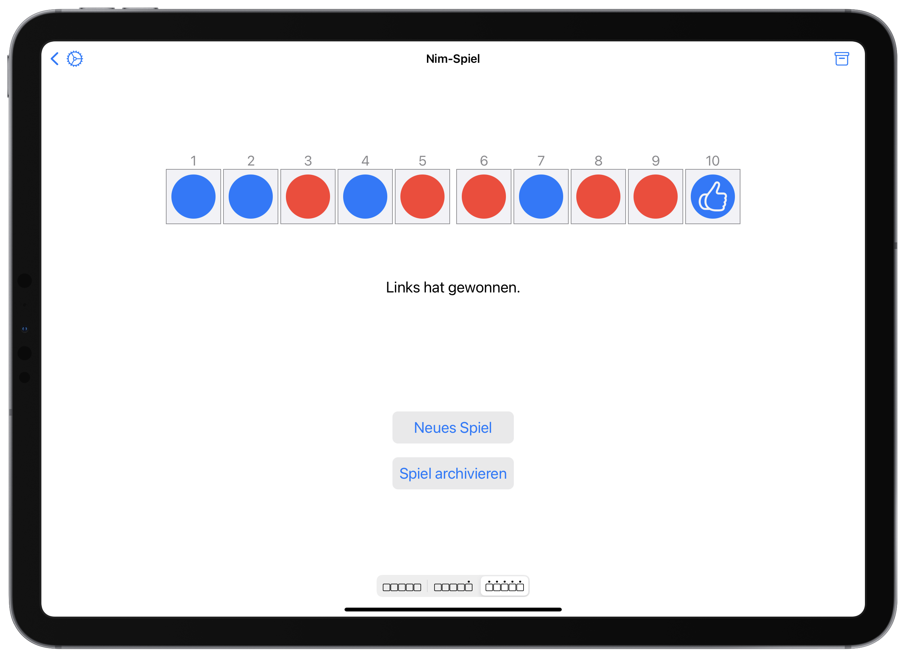
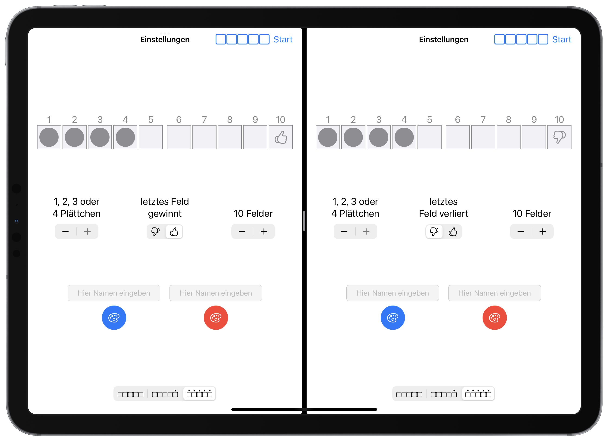
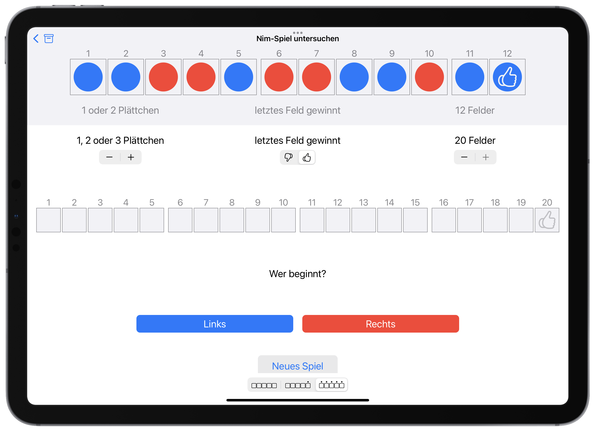
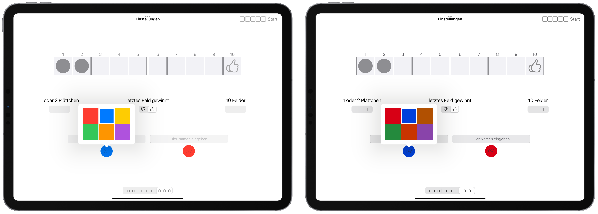

# Die Nim-App

Die Nim-App besteht aus bis zu vier Navigationsebenen:

1. Zunächst werden **Einstellungen** zum Spiel vorgenommen.
2. Anschließend kann **gespielt** werden.
3. Die Spiele können in einem **Archiv** gesammelt werden, das verschiedene Sortier- und Speicheroptionen zulässt.
4. Außerdem ist möglich, einzelne Spiele aus dem Archiv heraus zu **untersuchen**.

Dabei ist jede Navigationsebene so gestaltet, dass sie möglichst **einfach und übersichtlich** auf dem Bildschirm dargestellt wird. Wenn das Display zu klein ist, muss ggf. von oben nach unten gescrollt werden.


## Einstellungen innerhalb der App

Wenn die App gestartet wird, zeigt sich ein Bildschirm mit diveresen Einstellungsmöglichkeiten für das Nim-Spiel. 
Folgende Werte können variiert werden:

* **Spielfeldlänge** von 5 bis 20
* **Legezahl** von 1 bis 4
* **letztes Feld** gewinnt oder verliert

Diese Begrenzungen wurden bewusst implementiert. 
Die App als solche soll keine »vollständige Simulation« bis hin zur Verallgemeinerung liefern, sondern eine Experimentierumgebung anbieten, deren Erfahrungen in didaktischen Kontexten zum weiteren (auch nicht-digitalen) Problemlösen und zu allgemeineren Begründungen anregen sollen.

Darüber hinaus können die **Namen** und **Farben** der beiden Spieler/-innen angepasst werden.

```{r Einstellungen, echo=FALSE, fig.cap="Einstellungsbildschirm der Nim-App", fig.align='center', out.width='75%'}

```

Am unteren Bildschirmrand gibt es noch die Möglichkeit, jederzeit die **Nummerierung der Felder** anzupassen: entweder gar keine, jedes fünfte Feld oder alle Felder.
Diese Einstellung kann auch in der globalen Einstellungsapp vorgenommen bzw. geändert werden (siehe Abschnitt \@ref(globale-einstellungen)). 

Sobald alle gewünschten Einstellungen vorgenommen wurden, kann das Spiel über den **Start**-Knopf oben rechts begonnen werden.


## Spielen

Bevor das erste Plättchen positioniert wird, muss über die **farbigen Buttons** ausgewählt werden, wer beginnt.

Anschließend kann die maximale Anzahl an Plättchen über das **Antippen der entsprechenden Felder** gelegt werden. 
Die App gibt dabei **Rückmeldungen**, falls versucht werden sollte, zu viele Plättchen oder diese nicht in der richtigen Reihenfolge zu legen.

Sobald ein Spieler seinen Zug beenden will, betätigt er seinen Fertig-Button und der andere Spieler ist dran. 

Mit dem Ausfüllen des letzten Feldes erfolgt eine Rückmeldung, welcher Spieler gewonnen hat. 
Anschließend kann das Spiel ins **Archiv bewegt** werden oder man startet jederzeit, ohne Archiv, ein **neues Spiel**.

```{r Spielbildschirm, echo=FALSE, fig.cap="Spiel-Bildschirm der Nim-App", fig.align='center', out.width='75%'}

```


### Notizen machen

Über die Multitasking-Funktion des iPads (siehe https://support.apple.com/de-de/HT207582) ist es möglich, neben der Nim-App auch eine weitere App zu öffnen, die Multitasking unterstützt. So kann etwa die Notizen-App daneben gelegt werden, um Vermutungen hinsichtlich der Spielstrategie zu notieren.

```{r Splitscreen, echo=FALSE, fig.cap="Splitscreen mit der Notizen-App", fig.align='center', out.width='90%'}

```


### Doppelt spielen

Die Multitasking-Funktion ist ebenfalls geeignet, um die Nim-App selbst zweimal nebeneinander geöffnet zu haben, wenn etwa das Spiel mit verschiedenen Parametern vergleichend durchgeführt werden soll.

```{r Doppelapp, echo=FALSE, fig.cap="Splitscreen mit der Nim-App selbst", fig.align='center', out.width='75%'}

```


## Archivieren und Untersuchen

Im Archiv werden alle gespeicherten Spiele dargestellt. 

* Über **Drag-and-Drop-Gesen** können die **Archiveinträge umsortiert** werden. Bitte beachten Sie, dass es bei unterschiedlichen Feldlängen innerhalb des Archivs ggf. zu Verschiebungen in der Darstellung kommen kann. 

* Über den **Sortier-Button** oben rechts gibt es die Möglichkeit, die Spiele **der Länge nach**, **chronologisch** zu sortieren, beides **sowohl aufsteigend als auch absteigend**, oder bezüglich der **beginnenden Farbe**.

```{r Sortieren, echo=FALSE, fig.cap="Sortiermöglichkeiten im Archiv", fig.align='center', out.width='75%'}

```

* Das Archiv kann auch vollständig oder in einer Auswahl **exportiert** bzw. als **pdf-Datei** ausgedruckt/gespeichert/geteilt werden. Hierfür stehen die Buttons am unteren rechten Rand zur Verfügung. Die pdf-Datei wird dabei in schwarz-weiß dargestellt.

```{r Export, echo=FALSE, fig.cap="Export der pdf-Datei", fig.align='center', out.width='75%'}
knitr::include_graphics("pictures/Export.png")
```

* **Öffnet** man ein zuvor gespeichertes Archiv (z. B. über die Dateien-App), kann man dieses **zu seinem bisherigen Archiv hinzufügen** oder das **alte Archiv überschreiben**.

* **Tippt** man im Archiv ein einzelnes Spiel an, erhält man die Möglichkeit, dieses nach einer Bestätigungsabfrage zu **löschen** oder **genauer zu untersuchen**. Im letzteren Fall wird dann das gespielte Spiel sowie ein weiteres Spiel mit zunächst denselben Einstellungen dargestellt. Die Einstellungen des zweiten Spiels sind nun variierbar, d. h. es kann parallel und vergleichend zum ursprünglich dargestellten Spiel gespielt werden.

```{r Untersuchen, echo=FALSE, fig.cap="Untersuchen und Abwandeln eines bereits gespielten Spiels", fig.align='center', out.width='75%'}

```

* Über den **Papierkorb-Button** unten links kann das **vollständige Archiv gelöscht** werden (ebenfalls mit vorheriger Bestätigungsabfrage).

Für den Unterricht ergeben sich aus diesen Bedienmöglichkeiten einige ertragreiche Szenarien:


### Sinnvolles Sortieren

Wie bereits in Abschnitt \@ref(pool-an-spielverlaeufen) erläutert, ist es für eine geziele Analyse und das Finden der Gewinnstrategie  notwendig, eine *adäquate Dokumentationspraxis* zu schulen. 
Die App unterstützt dies dahingehend, dass die Spiele immer entsprechend der zu betrachtenden Parameter (»Wer fängt an?«, »Wie viele Plättchen durfte man legen?«, …) umsortiert werden kann. 
Auch in der pdf-Datei wird die jeweils aktuelle Sortierung dargestellt, sodass eine Analyse ggf. auch »offline« stattfinden kann. 
Gleichzeitig bietet sich über die chronologische Sortierung immer die Möglichkeit, zur »Ausgangssituation« zurück zu springen. 

### Archive aus Klasse sammeln

Sobald Ihre Schülerinnen und Schüler einige Spiele im Archiv gespeichert haben, können sie es exportieren und Ihnen per AirDrop schicken (siehe https://support.apple.com/de-de/HT204144). 
Sie selbst können dann bei den empfangenen Dateien jeweils ihr Archiv ergänzen, so dass Sie letztlich die Spiele von allen Kindern gesammelt haben. 
Damit können anschließend im Plenum (z. B. auf einem interaktiven Whiteboard) vielfältige Vergleiche vorgenommen und Strategien besprochen werden.

### Spiele zum Analysieren vorgeben

Auf dieselbe Weise können Sie Ihren Schülerinnen und Schülern auch einzelne Spiele schicken, so dass sie diese analysieren können. 
Dabei können Sie auf die Funktion zurückgreifen, nur Teile des Archivs zu versenden, wenn Sie den Auswahl-Button (drei Punkte im Kreis) vorher antippen.

## Globale Einstellungen

In den globalen App-Einstellungen (graue Zahnrad-App, anschließend nach unten scrollen bis zur Nim-App) können mehrere globale Einstellungen vorgenommen werden:

* Die **Nummerierung der Felder** kann angepasst werden: keine, jedes fünfte oder alle.

* Sie können die **Änderung der Nummerierung aktivieren/deaktivieren**. Dies kann in bestimmten Unterrichtssituationen hilfreich sein, wenn Sie eine bestimmte Art der Nummerierung bevorzugen, die nicht während des Spiels spontan geändert werden soll.

* Es kann der **Einzel-Export** von Spielen aktiviert/deaktiviert werden. Ein Deaktivieren führt dazu, dass im Archiv ein Button weniger sichtbar ist. Dies ist in manchen Unterrichtssituationen von Vorteil, damit die Schülerinnen und Schüler nicht aus Versehen darauf tippen.

* Sie können aktivieren/deaktivieren, dass beim Export des Archivs die **Namen der Spieler/-innen anonymisiert** werden. Normalerweise werden beim Untersuchen eines Spiels aus dem Archiv die eingegebenen Namen beider Personen dargestellt, die gespielt  hatten. Ein Anonymisieren ist insbesondere dann sinnvoll, wenn Archive zwischen verschiedenen Geräten hin und her geschickt werden und nicht nachvollzogen werden soll, wer ein Spiel gespielt hat. In der pdf-Datei werden standardmäßig keine Namen dargestellt.

* Weiterhin kann die **Sprache** des Spiels angepasst werden. Folgende Sprachen werden derzeit unterstützt:
  * Deutsch
  * Englisch
  * Französisch
  * Arabisch
  * Ukrainisch
  * Russisch
  * Kölsch
  
  Üblicherweise wird im Spiel die Systemsprache des Gerätes verwendet. Wenn diese nicht vom Spiel unterstützt wird (z. B. Spanisch), dann wird im Spiel automatisch Englisch verwendet. Je nach Zusammensetzung Ihrer Klasse können so einzelne Schülerinnen und Schüler ggf. flexibel ihr Spiel anpassen.
  
  Sollten Sie eine Sprache beherrschen, die derzeit nicht vom Spiel unterstützt wird, freuen wir uns über Ihre Unterstützung bei der Übersetzung, siehe dazu Abschnitt \@ref(uebersetzungen).


## Bedienungshilfen

Die App unterstützt einige der betriebssysteminternen Bedienungshilfen, die es Kindern mit besonderen Bedürfnissen ermöglichen, am Spielen teilhaben zu können.

### Farben und Kontraste

Die Nim-App unterstützt die kontrastreichere Darstellung von Farben, wenn diese über die Bedienungshilfen aktiviert werden (siehe https://support.apple.com/de-de/HT207025). 
Über die entsprechenden Einstellungen können auch Farbfilter, bspw. bei Farbfehlsichtigkeiten, angepasst werden.

Auch der Dunkelmodus (siehe https://support.apple.com/de-de/HT210332) wird von der Nim-App unterstützt.

```{r FarbenHell, echo=FALSE, fig.cap="Hellmodus mit normalem und hohem Kontrast", fig.align='center', out.width='75%'}

```

```{r FarbenDunkel, echo=FALSE, fig.cap="Dunkelmodus mit normalem und hohem Kontrast", fig.align='center', out.width='75%'}
knitr::include_graphics("pictures/Farben-dunkel.png")
```

### Schriftgröße

Weiterhin werden von der App dynamische Schriftgrößen unterstützt. Diese können entweder global eingestellt werden (siehe https://support.apple.com/de-de/HT202828) bzw., ab iOS 15, auch für einzelne Apps (siehe https://support.apple.com/de-de/guide/ipad/ipad723b5a33/15.0/ipados/15.0). Mit dieser Option sollte jedoch behutsam umgegangen werden, da die Bildschirmdarstellung dadurch deutlich verschoben und zumindest ungewöhnlich aussehen kann.

```{r Textgroesse, echo=FALSE, fig.cap="Normale und größere Schriftgröße", fig.align='center', out.width='75%'}

```

### Texte vorlesen

Die im System verankerte Funktion »VoiceOver« (siehe https://support.apple.com/de-lu/guide/ipad/ipad9a246898/ipados) ermöglicht das Vorlesen einzelner Bildschirminhalte. 
Eine Bedienung bei eingeschalteter VoiceOver-Funktion ist nicht trivial und sollte daher nur dann genutzt werden, wenn (bspw. blinde oder sehbehinderte) Schülerinnen und Schüler darauf angewiesen sind.

Innerhalb der Nim-App wurden in der deutschen und englischen Sprachversion für einige Bedienelemente spezifische Texte hinterlegt. 
Wird beispielsweise die Farbwahl geöffnet und ein farbiges Feld angetippt, so wird vom Gerät die entsprechende Farbe vorgelesen. Auch beim Antippen des Spielfeldes wird vorgelesen, um welches Feld (z. B. »Feld 3 von 10«) es sich gerade handelt.

Die Realisierung dieser Unterstützung wurde jedoch bisher noch nicht mit Schülerinnen und Schülern erprobt, die auf das Vorlesen von Bildschirminhalten angewiesen sind. 
Sollten Sie über entsprechende Erfahrungen verfügen, freuen wir uns sehr über eine Rückmeldung
